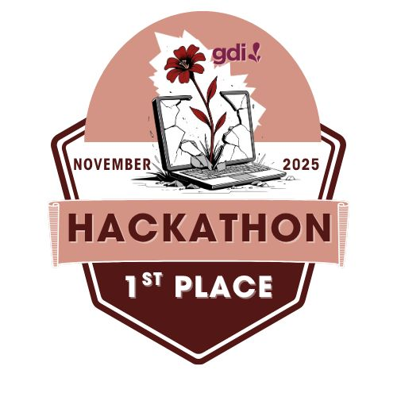
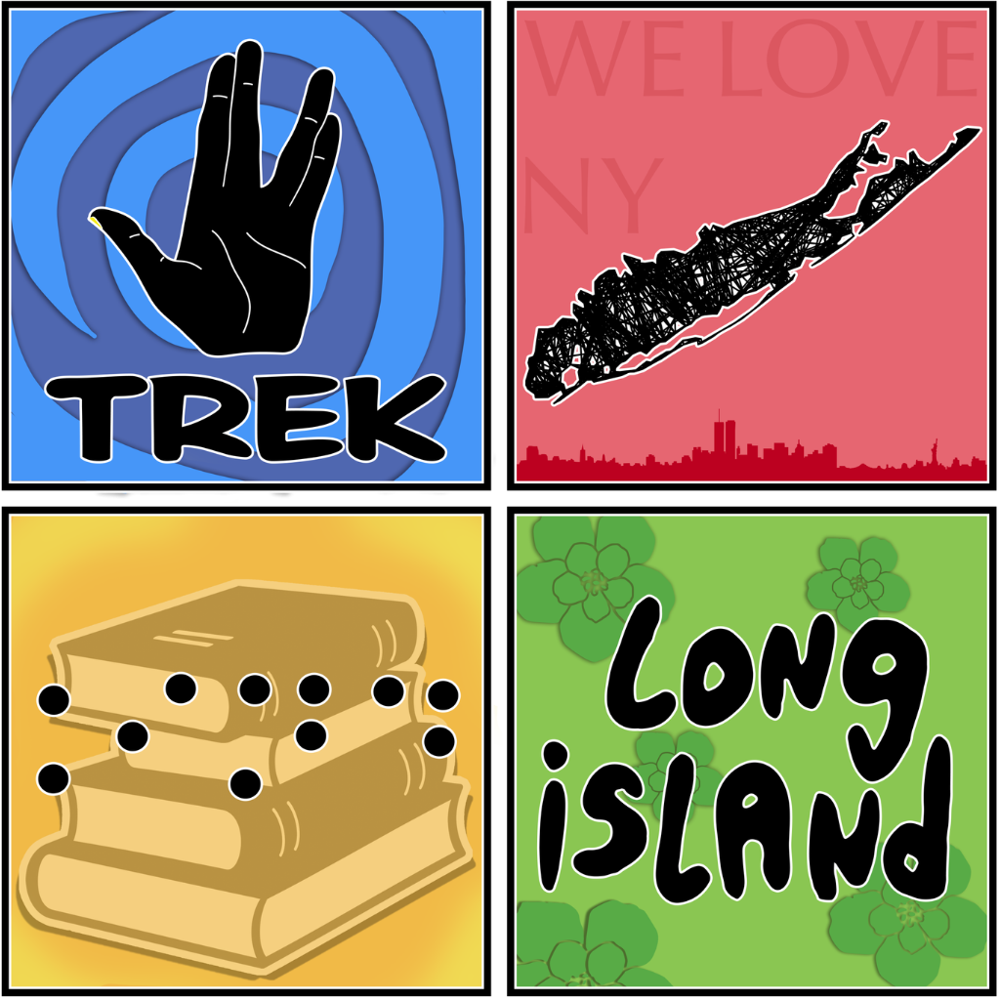

## 🍒 Hi there, I'm Babz!

🎨 Graphic Designer × Jr Full Stack Developer × Aspiring UX/UI Designer

Graphic designer transitioning into UX/UI and web development, bridging visual creativity with technical innovation. Well versed in Adobe Creative Suite, I bring a strong design foundation and a growing technical skill set in HTML, CSS, JavaScript, TypeScript, React, React Native, and SQL. Passionate about accessible, user centered design and the empathy driven process behind it, committed to building inclusive digital experiences that solve real problems for real people.

---

## 🏆 Achievements

**🥇 GDI Hackathon 1st Place | November 2025**

Participated in Girl Develop It's 4 day "Break Through 2025" hackathon where my team built **Spending Checkpoint**, a Chrome extension that helps users make mindful purchasing decisions. My role was UX/UI Design. I designed Penny, our friendly feline spending buddy, created her visual identity, and built an accessible interface following WCAG guidelines including screen reader support, keyboard navigation, light/dark mode and reduced motion preferences.

🔗 [View Spending Checkpoint](https://github.com/ggrossvi/spending-checkpoint)

---

**📱 Trek Long Island 2026 Official Convention App | 2026**

My first real world commissioned project. Hired by Trek Long Island to design and develop the official companion app for their annual Star Trek convention. Built with React Native + Expo SDK 56 and published to both the Apple App Store and Google Play Store.

🔗 [View Trek LI App](https://github.com/Babz-G/trek-li-app-2026)

---

## 🛠️ Skills

**Languages**

**Frameworks & Libraries**

**Tools & Platforms**

**Design & Creative Tools**

---

## 👁️ Currently

- 💻 **Graphic designer and artist** transitioning into web development and UX/UI design
- 🌐 Working as a **Jr. Full Stack Dev Intern**
- 📚 Enrolled in a **coding bootcamp** expanding my full stack skills
- 📱 Building and shipping **real world React Native apps** to the App Store and Google Play
- 🎨 Pursuing opportunities in **UX/UI Design**
- 👁️ Passionate about **accessible, inclusive design** following WCAG guidelines

---

## 🔗 Connect with Me

